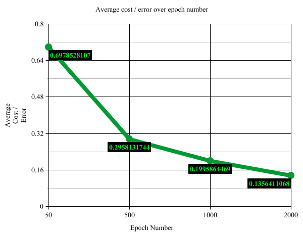

# CuisineConnoisseur

### How To Run:
1. path to the directory with driver.py, NN.py, setup.py, recipe.py, jsonReader.py, and run.sh
2. make sure to include in that directory ingredients.json and training.json
3. execute `./run.sh`
  * NOTE: the bash script is currently configured to operate on ingredients.json and training.json; if you wish to change this, simply change those input statements for another json of attributes and training data.

### Adjustable Parameters:
These can be found at the top of driver.py under the comment 'Adjustable Hyperparameters'
* epochs -> this is the number of back-propogations which will be performed per fold
* k -> this is the number of folds to divide the data into
* l_rate -> this is the learning rate that determines how far the delta-weights can pull the previous weights per epoch

### Method -- Neural Network:

We used a neural network for this project. Our project consists of a setup.py file, an NN.py file which defines the ANN() class containing the meat of the neural network architecture, and a driver.py file which conducts preprocessing tasks, builds training/testing features & labels, and runs the network using a 6-fold cross validation testing scheme.

Our setup file is a simple wrapper for readability. It is a series of related functions that takes in the names of json files to read in, and then makes use of our jsonReader class to setup up a list of attributes and a list of training data. For the training data, it will initialize an instance of the recipe class for each input and, for each, will assign its unique id number (uid), cuisine category string (label), and an ingredient bitarray (ingredients). This bitarray contains a bit for each attribute where non-present ingredients are a 0 and present ones are a 1.

Our ANN class defines a generalized artificial neural network with 3 layers: a input layer, a single hidden layer, and an output layer. Our hidden layer consists of 10 neurons. The forward() function of the ANN propogates all training-example features through our network, all at once. The backprop() function calculates the delta-weight values, including the weight on the biases. These weights are subsequently updated in the w_update() function. By using matrices that hold the information of all our training examples and running all the examples through the network in each epoch, we can pass forward and then back-propogate through our network in a fast and optimized fashion (i.e we are not using stochastic GD).

Let's get a little more into the intuitive explanation behind back-propogation. We know we want to change our weights based on the network cost (the mean squared error over all training examples, for a given epoch). More precisely, we want find the rate-of-change between our cost values with respect to our weights. Importantly, the costs result from forward-propogating through our network, getting the output, and subtracting with our true labels. We can thus say that our cost is a function of our output and true labels. Our output (output layer activation) is subsequently a function of our z2 term, which is a function our W2 term, B2 term, and a1 term (and so on for each hypotehtical layer). It follows then that indirectly, we can say that our cost is a function of our weights. In order to calculate the derivative of our cost function, we must multiply the chain of partial derivatives that allow us to relate the rate of change of weights to the cost.  

Our driver function defines all our network hyperparameters (number of epochs, number of k-folds, learning rate, etc). It builds 6 'clusters' of data using the cf_validation() and kfold() functions, from which we subsequntly build a set of all possible train/test pairings. We subsequently run the network on each of the six pairings using run(), producing the mean squared error (cost) and accuracies for each pairing. We then finally calculate the average overall accuracy and cost of our neural network.

### Accuracies:

Some sample accuracies from 6-fold cross-validation (_highest per is italicized_, **lowest is bolded**):

| FOLD 	| 50 epochs      	    | 500 epochs          | 1000 epochs         | 2000 epochs    	    |
|------	|--------------------	|--------------------	|--------------------	|--------------------	|
| 0    	| 0.311036789298 	    | 0.698996655518 	    | _0.839464882943_ 	  | 0.846153846154 	    |
| 1    	| 0.347826086957 	    | _0.792642140468_ 	  | 0.795986622074 	    | **0.826086956522** 	|
| 2    	| 0.357859531773 	    | 0.755852842809 	    | 0.779264214047 	    | _0.886287625418_ 	  |
| 3    	| **0.267558528428** 	| **0.648829431438** 	| 0.812709030100 	    | 0.859531772575 	    |
| 4    	| _0.377926421405_ 	  | 0.705685618729 	    | 0.832775919732 	    | 0.852842809365 	    |
| 5    	| 0.327759197324 	    | 0.675585284281 	    | **0.775919732441** 	| 0.846153846154 	    |

And averages:

|     	   | 50 epochs      	    | 500 epochs          | 1000 epochs         | 2000 epochs    	    |
|--------- |--------------------	|--------------------	|--------------------	|--------------------	|
| **AVRG** | 0.331661092531 	    | 0.712931995541 	    | 0.806020066890 	    | 0.852842809365 	    |

### Costs / Errors:

Some sample costs / errors from 6-fold cross-validation (**highest per is bolded**, _lowest is italicized_):

| FOLD 	| 50             	    | 500            	    | 1000           	    | 2000           	    |
|------	|--------------------	|--------------------	|--------------------	|--------------------	|
| 0    	| 0.701826782104 	    | 0.295191421140 	    | _0.170961967811_ 	  | 0.145065824116 	    |
| 1    	| 0.675230070862 	    | _0.242029393000_ 	  | 0.214567061180 	    | **0.159498909199** 	|
| 2    	| 0.698696862067 	    | 0.256012607714 	    | 0.199183352604 	    | _0.112092391518_   	|
| 3    	| **0.714779792030** 	| **0.368262458434** 	| 0.193857587727 	    | 0.128988992820 	    |
| 4    	| _0.697604262262_ 	  | 0.306093104757 	    | 0.185395734980 	    | 0.125987036302 	    |
| 5    	| 0.698979094749 	    | 0.307290061198 	    | **0.233552977155** 	| 0.142213486649 	    |

And averages:

|     	   | 50 epochs      	    | 500 epochs          | 1000 epochs         | 2000 epochs    	    |
|--------- |--------------------	|--------------------	|--------------------	|--------------------	|
| **AVRG** | 0.697852810679 	    | 0.295813174374 	    | 0.19958644691 	    | 0.135641106767 	    |

### Useful Sources:
* [3blue1brown ANN Tutorial](https://www.youtube.com/watch?v=tIeHLnjs5U8)
* [Welsch Labs Neural Networks Demystified Tutorials](https://www.youtube.com/watch?v=bxe2T-V8XRs)

### Authors:
* Hasan Khan kh4cd
* Zachary Danz zsd4yr
